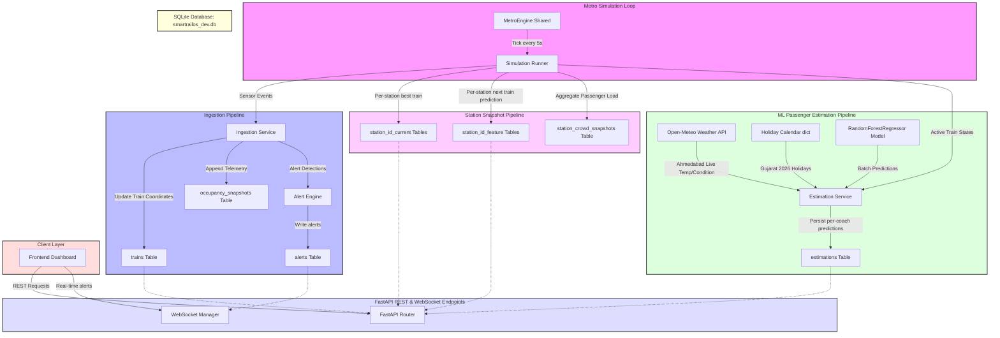

# SmartRail-OS — Ahmedabad Metro Telemetry, Data Engine & ML Passenger Simulator

SmartRail-OS is a real-time transit telemetry and analytics platform modelled on the **Ahmedabad Metro GMRC Phase-1** (33 stations, 21 active trains, Peak/Non-Peak headways, General/Ladies coach splits).

The platform tracks train coordinates and uses a **RandomForest ML model** to estimate boarding and deboarding counts per coach in real time.

---

## 🚀 Getting Started — Backend & Database

### Prerequisites

Make sure you have the following installed:

```bash
python3 --version      # Python 3.11+
pip3 install -r backend/requirements.txt
pip3 install datasette  # for the optional DB browser
```

---

### Step 1 — Seed the Database

Initialize the SQLite database and populate all static master data (stations, lines, routes, trains roster):

```bash
cd backend
PYTHONPATH=. python3 init_db.py
```

> **What this does:** Drops & recreates all tables, then seeds 33 stations, 21 trains, 4 routes and their stops into `backend/smartrailos_dev.db`.
> Run this once before starting the server for the first time, or any time you want a clean reset.

---

### Step 2 — Start the Backend API & Simulation Engine

```bash
cd backend
PYTHONPATH=. python3 -m uvicorn app.main:app --port 8000 --reload
```

> **What this does:**
> - Starts the FastAPI server at **`http://localhost:8000`**
> - Interactive Swagger docs: **`http://localhost:8000/docs`**
> - Launches the background **Simulation Runner** that ticks every 5 seconds to:
>   - Update all train positions from the MetroEngine timetable
>   - Write real-time snapshots to `station_<id>_current` and `station_<id>_feature` tables (one pair for each of the 33 stations)
>   - Run the ML passenger estimation pipeline
>   - Detect and broadcast congestion alerts

---

### Step 3 — Explore the Database (Datasette — Optional)

```bash
cd backend
datasette serve smartrailos_dev.db --host 0.0.0.0 --port 8765
```

> **What this does:** Opens a read-only browser at **`http://localhost:8765`**

Key tables to watch live (refresh after Step 2 is running):

| URL | What you see |
|---|---|
| `http://localhost:8765/smartrailos_dev/station_bl08_current` | Current train at station BL08 right now (dwelling / arriving / just departed) |
| `http://localhost:8765/smartrailos_dev/station_bl08_feature` | Upcoming train predictions for station BL08 |
| `http://localhost:8765/smartrailos_dev/trains` | Live train positions & journey progress |
| `http://localhost:8765/smartrailos_dev/estimations` | ML coach-level passenger predictions |

---

### Step 4 — Run the Test Suite

```bash
cd backend
PYTHONPATH=. pytest tests/
```

> Runs 15 automated tests covering: catalog routing, ingestion pipeline, ML estimations, and station current/feature endpoints.

---

### Step 5 — Standalone ML Model Testing (Optional)

Train the RandomForest model manually, view feature importances, or run predictions outside the server:

```bash
cd passenger_estimation
python3 estimation.py
```

---

## 📊 System Dataflow Architecture



### Ingestion Dataflow (Every 5s Tick)

- **MetroEngine** computes the deterministic state of all 21 trains across Blue and Red lines using timetabled departures and linear interpolation of run/dwell times.
- The **Simulation Runner** processes these states in parallel:
  - **Telemetry Ingestion:** Updates `trains` table, appends to `occupancy_snapshots`, and triggers the **Alert Engine**.
  - **Station Snapshots:** Writes one row per station into dedicated `station_<id>_current` tables (which train is here now, with arrival/departure times and coach-wise occupancy) and `station_<id>_feature` tables (the next upcoming train, with estimated passenger load predictions).
  - **Estimation Pipeline:** Feeds live train states to the ML service.

### Passenger Estimation Dataflow

- **EstimationService** fetches live Ahmedabad weather from **Open-Meteo** (cached 15 min) and checks `GUJARAT_HOLIDAYS_2026`.
- The pre-trained **RandomForestRegressor** performs batch inference predicting estimated alighting, boarding, and post-stop passenger load per coach.
- Results are persisted into the `estimations` table.

---

## 💾 SQLite Database Design

`backend/smartrailos_dev.db` is the single source of operational truth.

### Tables Reference

| Table | Type | Primary Key | Description |
|---|---|---|---|
| `stations` | Master | `station_id` (natural) | 33 station master records (name, interchange flag, busy factor). Interchange `Old High Court` exists as both `BL11` and `RL07`. |
| `trains` | Live State | `train_id` (natural) | Real-time train positions, journey % complete, and live coach passenger counts. |
| `train_coaches` | Master | `id` (autoincrement) | Coach config per train (GENERAL/LADIES, 400 capacity each). |
| `routes` | Master | `route_id` (natural) | 4 routes: `BL-UP`, `BL-DOWN`, `RL-UP`, `RL-DOWN`. |
| `route_stops` | Master | `id` (autoincrement) | Per-stop arrival/departure offsets from terminal. |
| `station_<id>_current` (x33) | Live Snapshot | `id` (autoincrement) | **Current train snapshot for each station** — status (at\_platform / arriving / just\_departed), ETA seconds, arrival/departure times, passenger count, coach-wise occupancy and percentage. Capped at 1 row. |
| `station_<id>_feature` (x33) | Predictive Snapshot | `id` (autoincrement) | **Next upcoming train prediction for each station** — estimated arrival/departure time, predicted boarding, alighting, and coach-wise passengers/percentages. Capped at 1 row. |
| `station_crowd_snapshots` | Transactional | `id` (autoincrement) | Aggregated total passengers at each station platform over time. |
| `occupancy_snapshots` | Transactional | `id` (autoincrement) | Per-train, per-event occupancy telemetry. |
| `estimations` | Transactional | `id` (autoincrement) | ML coach-level passenger predictions for upcoming stops. |
| `alerts` | Operational | `id` (UUID) | System alerts (platform congestion, train capacity warnings). |

> **Data Retention:** Snapshot and estimation tables are capped at **24 hours of history**. The simulation runner purges rows older than 24 hours on every tick.

---

## 🔌 API Endpoints Contract

All endpoints are prefixed with `/api/v1`. Full interactive docs at `http://localhost:8000/docs`.

### Catalog
| Method | Path | Description |
|---|---|---|
| GET | `/catalog/lines` | Blue and Red line metadata |
| GET | `/catalog/stations` | All 33 metro stations |
| GET | `/catalog/routes` | All schedules and route offsets |
| GET | `/catalog/trains` | Active trains with live positions |

### Occupancy & Dashboard
| Method | Path | Description |
|---|---|---|
| GET | `/occupancy/trains` | Coach-level occupancy for all active trains |
| GET | `/occupancy/stations` | Crowd metrics for all stations |
| GET | `/dashboard/snapshot?station_name=Kalupur Metro Station` | Combined status snapshot for a station |

### Station Detail Views
| Method | Path | Description |
|---|---|---|
| GET | `/stations/{station_id}/current` | The train currently at this station — arrival/departure times, coach-wise occupancy & %. Status: `at_platform`, `arriving`, `just_departed`, or `none`. |
| GET | `/stations/{station_id}/feature` | Prediction for the next upcoming train — estimated arrival/departure, boarding/alighting, and coach-wise load. |

### WebSocket
| Path | Description |
|---|---|
| WS `/ws` | Real-time push alerts (platform congestion, train capacity warnings) |
