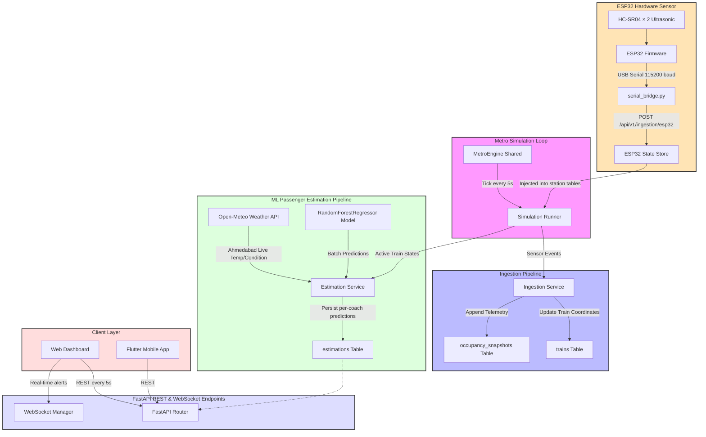

# SmartRail-OS 🚇⚡
**The Complete Digital Twin & Predictive Telemetry Platform for Modern Metro Networks**

[](https://fastapi.tiangolo.com/)
[](https://reactjs.org/)
[](https://flutter.dev/)
[](https://scikit-learn.org/)
[](https://www.espressif.com/en/products/socs/esp32)

*SmartRail-OS is not just a dashboard—it's a living, breathing Digital Twin of the Ahmedabad Metro (GMRC Phase-1). It combines real-time physics simulation, Machine Learning crowd forecasting, custom hardware edge-sensors, and a suite of cross-platform applications to revolutionize transit management.*

---

## 🏆 Why SmartRail-OS? 

Modern public transit systems generate massive amounts of data, yet operators and passengers often operate blindly. **SmartRail-OS** bridges this gap by creating a unified ecosystem:
1. **For Operators:** A God's-eye Command Center to monitor exact train physics, platform congestion, and emergency alerts.
2. **For Passengers:** A Flutter mobile app enabling predictive commuting—allowing users to choose less crowded coaches before the train even arrives.
3. **For the System:** A Machine Learning engine that doesn't just report data, but *predicts* it using live weather (Open-Meteo) and holiday calendars.

## 🚀 Key Features

- 🧠 **Machine Learning Crowd Forecasting:** A Random Forest Regressor predicts boarding/alighting and coach-level occupancy based on time-of-day, active holidays, and live weather conditions.
- 🏙️ **Physics-Based Digital Twin:** A simulation engine tracking 21 active trains across 33 stations, calculating exact geographic travel distances, ETA, and real-time headways.
- 📱 **Cross-Platform Ecosystem:**
  - **Operator Command Center:** A React/Vite dashboard providing high-fidelity heatmaps and system telemetry.
  - **Passenger Mobile App:** A Flutter application keeping commuters informed on the go.
- 🔌 **IoT Edge Integration:** Real hardware ESP32 microcontrollers with dual ultrasonic sensors count physical passengers and inject live occupancy data directly into the simulation.

---

## 📦 Project Structure

```text
SmartRail-OS/
├── backend/                 # FastAPI server, simulation engine, ML pipeline
│   ├── app/
│   │   ├── api/v1/          # REST endpoints (stations, trains, ingestion, esp32 …)
│   │   ├── core/            # Config, WebSocket manager, ESP32 state store
│   │   ├── services/        # Simulation runner (5-second tick) & ML Estimation
│   └── scripts/             # Database initialization & seeders
├── esp32-test/              # IoT Hardware Integration
│   ├── src/main.cpp         # Arduino firmware (dual ultrasonic sensor)
│   └── serial_bridge.py     # Python bridge: USB serial → backend API
├── smartrailos_web/         # React/Vite Dashboard (Command Center)
├── smartrailos_app/         # Flutter Mobile App (Passenger Application)
└── passenger_estimation/    # Standalone ML training scripts
```

---

## 🛠️ Getting Started

### Prerequisites

```bash
python3 --version          # Python 3.11+
node --version             # Node 18+  (for the web dashboard)
flutter --version          # Flutter SDK (for mobile app)
pip3 install -r backend/requirements.txt
```

### Step 1 — Seed the Database
Initialize the SQLite database and populate all static master data (33 stations, 21 trains, 4 routes):
```bash
cd backend
PYTHONPATH=. python3 init_db.py
```

### Step 2 — Start the Backend API & Simulation Engine
```bash
cd backend
PYTHONPATH=. python3 -m uvicorn app.main:app --port 8000 --reload
```
> **What this does:** Starts FastAPI at `http://localhost:8000`, interactive Swagger docs, and launches the **Simulation Runner** that ticks every 5 seconds (updates positions, generates ML estimations, broadcasts alerts).

### Step 3 — Start the Web Dashboard (Operator Command Center)
```bash
cd smartrailos_web
npm install
npm run dev
```
Open **`http://localhost:5173`** — the dashboard auto-refreshes every 5 seconds matching the backend simulation tick.

### Step 4 — Start the Flutter Mobile App (Android/iOS)
```bash
cd smartrailos_app
flutter pub get
flutter run
```
> **Note:** Update `AppConfig.baseUrl` in `smartrailos_app/lib/core/constants/app_config.dart` to your computer's local IP if testing on a physical device.

---

## 🔌 ESP32 Hardware Integration — Live Sensor Setup

The ESP32 firmware counts passengers entering/exiting through a door using **two HC-SR04 ultrasonic sensors** (direction detection). Live occupancy is injected into the simulation at any station, and the dashboard updates in real time.

### Step A — Flash the ESP32 Firmware
```bash
cd esp32-test
pio run --target upload --upload-port /dev/ttyUSB0
```

### Step B — Seed the ESP32 Dummy Train
```bash
cd backend
PYTHONPATH=. python3 scripts/seed_esp32_train.py
```

### Step C — Start the Serial Bridge
```bash
cd esp32-test
python3 serial_bridge.py
```
> This bridge reads `/dev/ttyUSB0`, parses occupancy changes, and POSTs to the backend every time the passenger count changes.

---

## 📊 System Dataflow Architecture



---

## 🔮 Future Scope

The SmartRail-OS architecture is engineered to scale and easily integrate with advanced smart-city technologies:

- **Predictive Maintenance:** Integrate IoT sensors from train engines and bogies to predict hardware failures before they occur, leveraging our existing ML pipeline.
- **City-Wide Traffic Integration:** Connect with local municipal APIs to correlate metro crowding with road traffic congestion and bus availability.
- **Automated Train Operation (ATO) Enhancements:** Feed ML predictions back into the physical train control systems to automatically adjust train speeds or dwell times based on platform crowding.
- **Multi-User Tracking from Edge Sensors:** Upgrade the platform to seamlessly calculate and track multiple users simultaneously from edge hardware sensors, providing ultra-precise, real-time ground-truth crowd analytics rather than relying solely on statistical heuristics.

---

> Designed & Built with ❤️ for the Future of Public Transit
