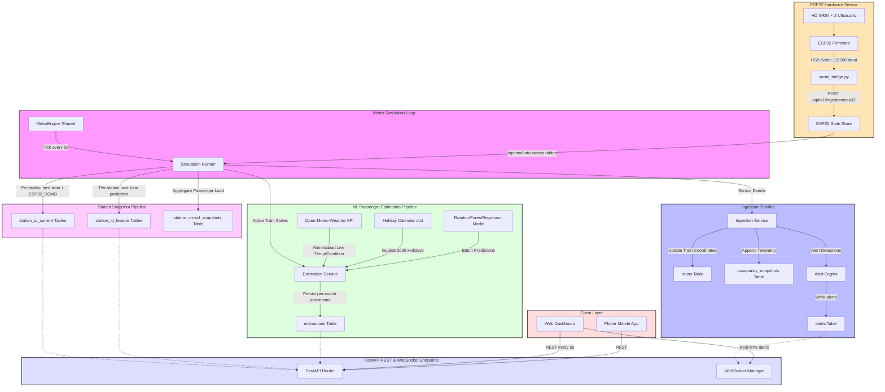

# SmartRail-OS — Ahmedabad Metro Telemetry, Data Engine & ML Passenger Simulator

SmartRail-OS is a real-time transit telemetry and analytics platform modelled on the **Ahmedabad Metro GMRC Phase-1** (33 stations, 21 active trains, Peak/Non-Peak headways, General/Ladies coach splits).

The platform tracks train coordinates and uses a **RandomForest ML model** to estimate boarding and deboarding counts per coach in real time. It also integrates with a **real ESP32 hardware sensor** (dual ultrasonic passenger counter) to feed live occupancy data into the simulation at any station.

---

## 📦 Project Structure

```
SmartRail-OS/
├── backend/                 # FastAPI server, simulation engine, ML pipeline
│   ├── app/
│   │   ├── api/v1/          # REST endpoints (stations, trains, ingestion, esp32 …)
│   │   ├── core/            # Config, WebSocket manager, ESP32 state store
│   │   ├── models/          # SQLAlchemy ORM models
│   │   ├── services/
│   │   │   ├── engine/      # Simulation runner (5-second tick)
│   │   │   └── domain/      # TrainService, OccupancyService, EstimationService
│   │   └── db/              # Session, seeder
│   └── scripts/
│       └── seed_esp32_train.py   # ← one-time ESP32 dummy train seeder
├── esp32-test/
│   ├── src/main.cpp              # Arduino firmware (dual ultrasonic sensor)
│   └── serial_bridge.py          # ← Python bridge: USB serial → backend API
├── smartrailos_web/         # React/Vite dashboard (TanStack Router + Query)
├── smartrailos_app/         # Flutter mobile app
└── passenger_estimation/    # Standalone ML training scripts
```

---

## 🚀 Getting Started

### Prerequisites

```bash
python3 --version          # Python 3.11+
node --version             # Node 18+  (for the web dashboard)
pip3 install -r backend/requirements.txt
```

---

### Step 1 — Seed the Database

Initialize the SQLite database and populate all static master data (stations, routes, trains):

```bash
cd backend
PYTHONPATH=. python3 init_db.py
```

> **What this does:** Drops & recreates all tables, then seeds 33 stations, 21 trains, 4 routes and their stops into `backend/smartrailos_dev.db`.  
> Run once before the first start, or any time you want a clean reset.

---

### Step 2 — Start the Backend API & Simulation Engine

```bash
cd backend
PYTHONPATH=. python3 -m uvicorn app.main:app --port 8000 --reload
```

> **What this does:**
> - Starts FastAPI at **`http://localhost:8000`**
> - Interactive Swagger docs: **`http://localhost:8000/docs`**
> - Launches the **Simulation Runner** that ticks every 5 seconds:
>   - Updates all 21 train positions from the timetable
>   - Writes `station_<id>_current` and `station_<id>_feature` snapshots for all 33 stations
>   - Runs the ML passenger estimation pipeline
>   - Detects and broadcasts congestion alerts via WebSocket

---

### Step 3 — Start the Web Dashboard

```bash
cd smartrailos_web
npm install       # first time only
npm run dev
```

Open **`http://localhost:5173`** — the dashboard auto-refreshes every 5 seconds matching the backend simulation tick.

---

### Step 4 — Start the Flutter Mobile App (Android/iOS)

If you are testing on a physical device, ensure your device is connected via USB and USB debugging is enabled.

```bash
cd smartrailos_app
flutter pub get
flutter run
```

> **Important Note for Mobile Testing:**
> If you are running the app on a physical phone, `localhost` points to the phone itself. You MUST update `AppConfig.baseUrl` in `smartrailos_app/lib/core/constants/app_config.dart` to point to your computer's local network IP address (e.g., `http://192.168.1.X:8000`) before running `flutter run`. Also ensure your phone and computer are on the same WiFi network.

---

### Step 5 — (Optional) Explore the Database Live

```bash
pip3 install datasette
cd backend
datasette serve smartrailos_dev.db --host 0.0.0.0 --port 8765
```

Key tables to watch at **`http://localhost:8765`**:

| Table | What you see |
|---|---|
| `station_bl08_current` | Current train at BL08 right now |
| `station_bl08_feature` | Upcoming train prediction for BL08 |
| `trains` | Live train positions & journey progress |
| `estimations` | ML coach-level passenger predictions |

---

### Step 6 — Run the Test Suite (Optional)

```bash
cd backend
PYTHONPATH=. pytest tests/
```

> Runs 15 automated tests covering: catalog routing, ingestion pipeline, ML estimations, station current/feature endpoints.

---

## 🔌 ESP32 Hardware Integration — Live Sensor Setup

The ESP32 firmware counts passengers entering/exiting through a door using **two HC-SR04 ultrasonic sensors** (direction detection). Live occupancy is injected into the simulation at any station, and the dashboard updates in real time.

### Hardware Required

| Component | Purpose |
|---|---|
| ESP32 Dev Board | Microcontroller |
| HC-SR04 × 2 | Ultrasonic distance sensors (entry detection) |
| USB cable | Serial communication + power |

**Wiring:**

| Sensor | TRIG | ECHO |
|---|---|---|
| Sensor 1 (inner) | GPIO 4 | GPIO 14 |
| Sensor 2 (outer) | GPIO 27 | GPIO 33 |

---

### Step A — Flash the ESP32 Firmware

Install [PlatformIO](https://platformio.org/) (VS Code extension or CLI), then:

```bash
cd esp32-test

# Build and upload to the connected ESP32
pio run --target upload --upload-port /dev/ttyUSB0

# Monitor live serial output to verify it's working
pio device monitor -p /dev/ttyUSB0 -b 115200
```

You should see output like:
```
PASSENGER IN
Occupancy: 1

PASSENGER OUT
Occupancy: 0
```

> **Port note:** On Linux it's usually `/dev/ttyUSB0`. On macOS it's `/dev/cu.usbserial-*`. On Windows it's `COM3` (or similar). Run `pio device list` to find yours.

---

### Step B — Seed the ESP32 Dummy Train

This adds the `ESP32_DEMO` train row to the database (only needed once):

```bash
cd backend
PYTHONPATH=. python3 scripts/seed_esp32_train.py
```

Output:
```
✓  Train 'ESP32_DEMO' seeded successfully.
   Coach C1 (GENERAL) — capacity 400 passengers.
```

> Safe to run multiple times — it's idempotent.

---

### Step C — Start the Serial Bridge

The bridge reads `/dev/ttyUSB0`, parses occupancy changes, and POSTs to the backend every time the count changes:

```bash
cd esp32-test

# Option 1: Show ESP32 train at ALL stations simultaneously
# (great for testing — open any station screen on the dashboard)
python3 serial_bridge.py

# Option 2: Pin it to one specific station
python3 serial_bridge.py --station BL05

# Option 3: Different port or backend URL
python3 serial_bridge.py --port /dev/ttyUSB1 --backend http://192.168.1.10:8000
```

You'll see live output:
```
============================================================
  SmartRail-OS  ·  ESP32 Serial Bridge
============================================================
  Port    : /dev/ttyUSB0  @  115200 baud
  Backend : http://localhost:8000
  Station : ALL stations
============================================================

✓  Connected to /dev/ttyUSB0
   Listening for occupancy data…

[23:10:42]  Occupancy  24  (6.0%)  →  ALL STATIONS  ✓
[23:10:51]  Occupancy  25  (6.2%)  →  ALL STATIONS  ✓
```

**Requirements for the bridge script:**
```bash
pip3 install pyserial requests
```

---

### How It All Connects

```
ESP32 Sensors (USB)
      │  "Occupancy: 24"
      ▼
serial_bridge.py
      │  POST /api/v1/ingestion/esp32
      │  { occupancy: 24, station_id: null }
      ▼
FastAPI Backend
      │  updates esp32_state singleton
      ▼
Simulation Runner (every 5s)
      │  writes ESP32_DEMO → station_*_current tables
      │  for all 33 stations (or just the targeted one)
      ▼
GET /api/v1/stations/{id}/current
      │  returns { train_id: "ESP32_DEMO", total_passengers: 24 … }
      ▼
Web Dashboard (auto-polls every 5s)
      └─ Station page shows live sensor count under "Station Current State"
```

**Station ID reference:**

| Line | IDs | Example |
|---|---|---|
| Blue Line | BL01 – BL18 | BL01 = Vastral Gam, BL11 = Old High Court |
| Red Line | RL01 – RL15 | RL07 = Old High Court (RL), RL08 = Kalupur |

---

### Full Stack — All Terminals Together

Open four terminals and run:

```bash
# Terminal 1 — Backend (simulation + API)
cd backend && PYTHONPATH=. python3 -m uvicorn app.main:app --port 8000 --reload

# Terminal 2 — Web Dashboard
cd smartrailos_web && npm run dev

# Terminal 3 — Serial Bridge (ESP32 plugged in via USB)
cd esp32-test && python3 serial_bridge.py

# Terminal 4 — (Optional) Database browser
cd backend && datasette serve smartrailos_dev.db --port 8765
```

Then open **`http://localhost:5173/dashboard/stations/BL01`** — walk through the sensor and watch the passenger count update live on screen within 5 seconds.

---

## 📊 System Dataflow Architecture



---

## 💾 SQLite Database Design

`backend/smartrailos_dev.db` is the single source of operational truth.

### Tables Reference

| Table | Type | Primary Key | Description |
|---|---|---|---|
| `stations` | Master | `station_id` | 33 station master records (name, interchange flag, busy factor). `Old High Court` exists as both `BL11` and `RL07`. |
| `trains` | Live State | `train_id` | Real-time train positions, journey % complete, and live coach passenger counts. Includes `ESP32_DEMO`. |
| `train_coaches` | Master | `id` | Coach config per train (GENERAL/LADIES, 400 capacity each). |
| `routes` | Master | `route_id` | 4 routes: `BL-UP`, `BL-DOWN`, `RL-UP`, `RL-DOWN`. |
| `route_stops` | Master | `id` | Per-stop arrival/departure offsets from terminal. |
| `station_<id>_current` (×33) | Live Snapshot | `id` | **Current train at each station** — status (`at_platform` / `arriving` / `just_departed`), ETA, coach-wise occupancy. ESP32_DEMO row injected here every tick. Capped at 1 row. |
| `station_<id>_feature` (×33) | Predictive Snapshot | `id` | **Next upcoming train prediction** — estimated arrival/departure, boarding/alighting, coach-wise load. Capped at 1 row. |
| `station_crowd_snapshots` | Transactional | `id` | Aggregated total passengers at each station platform over time. |
| `occupancy_snapshots` | Transactional | `id` | Per-train, per-event occupancy telemetry. |
| `estimations` | Transactional | `id` | ML coach-level passenger predictions for upcoming stops. |
| `alerts` | Operational | `id` (UUID) | System alerts (platform congestion, train capacity warnings). |

> **Data Retention:** Snapshot and estimation tables are capped at **24 hours**. The simulation runner purges rows older than 24 hours on every tick.

---

## 🔌 API Endpoints Contract

All endpoints prefixed with `/api/v1`. Full interactive docs at `http://localhost:8000/docs`.

### Catalog
| Method | Path | Description |
|---|---|---|
| GET | `/catalog/lines` | Blue and Red line metadata |
| GET | `/catalog/stations` | All 33 metro stations |
| GET | `/catalog/routes` | All schedules and route offsets |
| GET | `/catalog/trains` | Active trains with live positions |

### Occupancy & Dashboard
| Method | Path | Description |
|---|---|---|
| GET | `/occupancy/trains` | Coach-level occupancy for all active trains |
| GET | `/occupancy/stations` | Crowd metrics for all stations |
| GET | `/dashboard/snapshot?station_name=Kalupur Metro Station` | Combined status snapshot for a station |

### Station Detail Views
| Method | Path | Description |
|---|---|---|
| GET | `/stations/{station_id}/current` | Current train at this station — arrival/departure times, coach-wise occupancy. Returns `ESP32_DEMO` data when sensor is running. |
| GET | `/stations/{station_id}/feature` | Next upcoming train — estimated boarding/alighting, coach-wise load. |

### ESP32 Sensor Ingestion
| Method | Path | Description |
|---|---|---|
| POST | `/ingestion/esp32` | Receive live occupancy from the serial bridge. Body: `{ occupancy, station_id, coach_capacity }` |
| GET | `/ingestion/esp32/status` | Check the latest ESP32 sensor reading stored in memory |

### WebSocket
| Path | Description |
|---|---|
| WS `/ws` | Real-time push alerts (platform congestion, train capacity warnings) |
